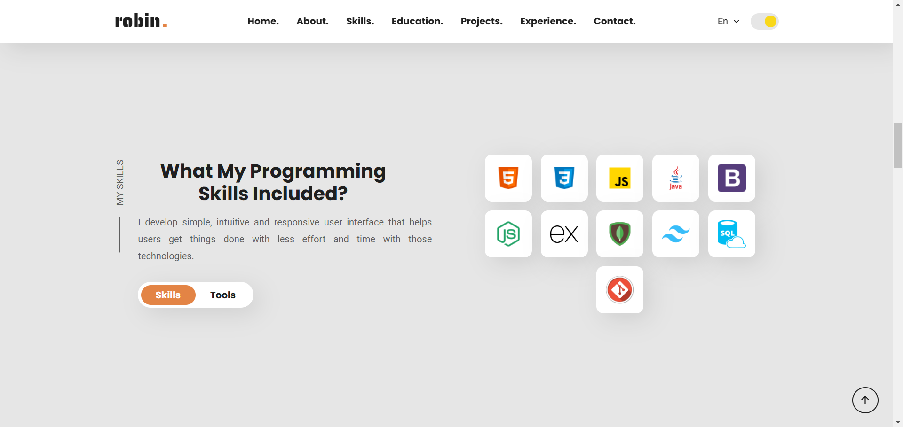
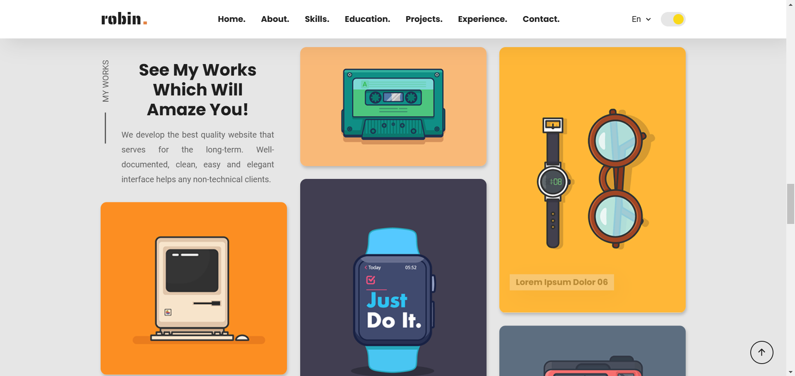

# Robin Sukhdeve Portfolio Website

---

[Live Link: Robin Sukhdeve Portfolio](https://robinsukhdeve.netlify.app/)

This is a personal portfolio website for showcasing my skills, projects, and professional journey. It provides visitors with an insight into my expertise as a web developer, Java enthusiast, and problem-solver with a strong foundation in data structures and algorithms.

## Features

- **Dark and Light Theme:** Seamlessly switch between light and dark modes.
- **Responsive Design:** Optimized for all devices, including mobile, tablet, and desktop.
- **Hero Section:** A welcoming introduction with links to connect via social platforms.
- **Skills & Tools:** Detailed sections showcasing technical proficiencies.
- **Projects:** Highlights of completed and ongoing projects.
- **Experience & Education:** Summary of my academic and professional journey.
- **Contact Form:** A simple form for visitors to reach out directly.

---

## Technologies Used

### Frontend:

- HTML5
- CSS3
- JavaScript
- Tailwind CSS (integrated for modern styles)

### Design:

- Fonts: [Google Fonts](https://fonts.google.com)
- Icons: [Ionicons](https://ionicons.com)

---

## Getting Started

To view the portfolio locally, follow these steps:

1. Clone the repository:

```bash
git clone https://github.com/Robin-2407/Robin-Sukhdeve-Portfolio.git
```

2. Navigate to the project directory:

```bash
cd portfolio-website
```

3. Open the `index.html` file in your preferred browser.

---

## Screenshots

### Hero Section

#### Dark Mode


#### Light Mode


### Skills Section

#### Dark Mode


#### Light Mode



### Projects Section

#### Dark Mode


#### Light Mode



---

## Contact

Feel free to reach out:

- Email: rsukhdeve.work@gmail.com
- LinkedIn: [Robin Sukhdeve](#)
- GitHub: [Robin-2407](#)
